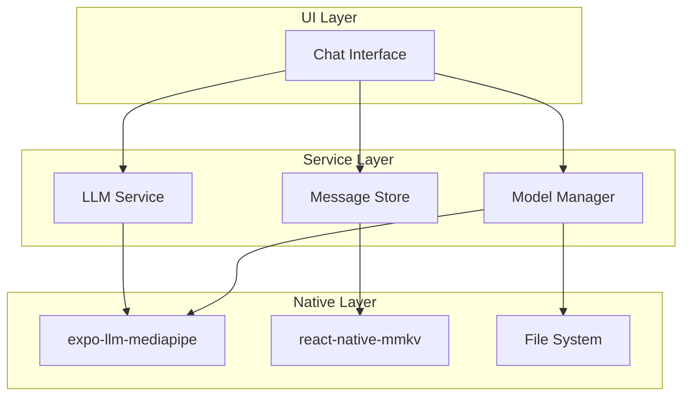
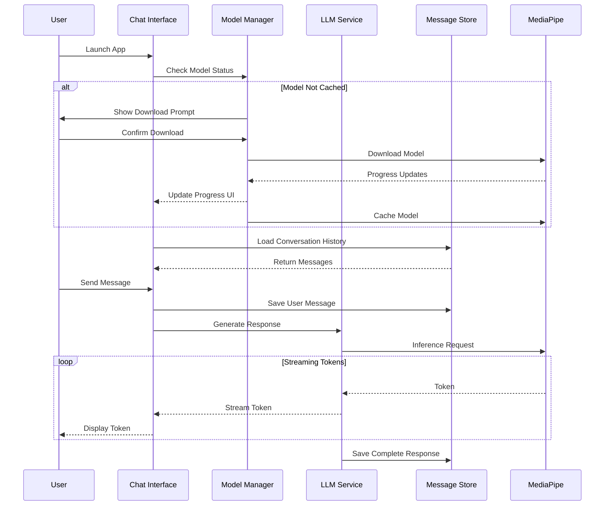

# Design Document: Offline Mindfulness Coach

## Overview

The Offline Mindfulness Coach is a React Native mobile application built with Expo that provides personalized mindfulness guidance through an on-device LLM (Gemma-3n-E4B). The application combines Buddhist and Stoic philosophical principles to help users navigate life challenges, with all processing happening locally for complete offline functionality.

### Key Design Principles

1. **Offline-First Architecture**: All core functionality works without network connectivity
2. **Performance Optimization**: Efficient model loading and inference with smooth UI interactions
3. **User Experience**: Clean, modern interface with streaming responses and thoughtful animations
4. **Data Privacy**: All conversations stored locally on device
5. **Scalability**: Modular architecture supporting future enhancements
6. **UI Component Library**: Exclusive use of Gluestack-UI components for all interactive elements

### UI Component Library Standards

**Gluestack-UI Component Usage**:
- ALL UI components MUST use Gluestack-UI components exclusively
- This includes: Slider, Button, Switch, Input, Select, Modal, Alert, and all other interactive elements
- Components should be installed via: `npx gluestack-ui add <component-name>`
- DO NOT use third-party component libraries like @react-native-community/slider
- DO NOT use custom implementations when Gluestack-UI provides the component
- Styling should use NativeWind (Tailwind CSS) classes alongside Gluestack-UI

**Component Installation Process**:
1. Check if component exists in `components/ui/` directory
2. If not available, install using: `npx gluestack-ui add <component-name>`
3. Import from `@/components/ui/<component-name>`
4. Follow Gluestack-UI documentation for proper usage patterns

**Example Component Usage**:
```typescript
// Correct: Using Gluestack-UI Slider
import { Slider, SliderTrack, SliderFilledTrack, SliderThumb } from '@/components/ui/slider';

<Slider minValue={0} maxValue={1} step={0.01} value={temperature}>
  <SliderTrack>
    <SliderFilledTrack />
  </SliderTrack>
  <SliderThumb />
</Slider>

// Incorrect: Using third-party slider
import Slider from '@react-native-community/slider'; // ❌ DO NOT USE
```

## Architecture

### High-Level Architecture



### Application Flow



### Directory Structure

```
app/
├── (drawer)/
│   ├── _layout.tsx              # Drawer navigation
│   ├── chat.tsx                 # Main chat screen
│   └── settings.tsx             # Settings screen
├── _layout.tsx                  # Root layout
└── outside.tsx                  # Existing outside page

services/
├── llm/
│   ├── LLMService.ts           # Core LLM inference service
│   ├── ModelManager.ts         # Model download & caching
│   ├── PromptBuilder.ts        # System prompt construction
│   └── types.ts                # LLM-related types
├── storage/
│   ├── MessageStore.ts         # Message persistence
│   ├── SettingsStore.ts        # App settings storage
│   └── types.ts                # Storage types
└── index.ts                    # Service exports

components/
├── chat/
│   ├── ChatMessage.tsx         # Individual message component
│   ├── ChatInput.tsx           # Message input field
│   ├── StreamingText.tsx       # Streaming text display
│   ├── TypingIndicator.tsx     # Loading animation
│   └── QuickActions.tsx        # Quick action buttons
├── model/
│   ├── ModelDownload.tsx       # Download progress UI
│   └── ModelStatus.tsx         # Model status indicator
└── ui/                         # Existing gluestack components

hooks/
├── useChat.ts                  # Chat state management
├── useLLM.ts                   # LLM service hook
├── useModelManager.ts          # Model management hook
└── useMessageStore.ts          # Message storage hook

constants/
├── prompts.ts                  # System prompts & templates
├── config.ts                   # App configuration
└── theme.ts                    # Theme constants

types/
├── chat.ts                     # Chat-related types
├── model.ts                    # Model-related types
└── index.ts                    # Type exports
```

## Components and Interfaces

### 1. Model Manager

**Responsibility**: Handle model download, caching, and validation

**Interface**:
```typescript
interface ModelManager {
  // Check if model is available locally
  isModelAvailable(): Promise<boolean>;
  
  // Get model download status
  getModelStatus(): Promise<ModelStatus>;
  
  // Download model with progress callback
  downloadModel(onProgress: (progress: DownloadProgress) => void): Promise<void>;
  
  // Validate cached model integrity
  validateModel(): Promise<boolean>;
  
  // Get model file path
  getModelPath(): Promise<string>;
  
  // Delete cached model
  deleteModel(): Promise<void>;
}

interface ModelStatus {
  isAvailable: boolean;
  isDownloading: boolean;
  downloadProgress?: number;
  modelSize?: number;
  lastValidated?: Date;
}

interface DownloadProgress {
  bytesDownloaded: number;
  totalBytes: number;
  percentage: number;
  estimatedTimeRemaining?: number;
}
```

**Implementation Details**:
- Uses Expo FileSystem for model storage
- Implements checksum validation for model integrity
- Stores model metadata in MMKV for quick status checks
- Handles download resumption on failure
- Provides atomic operations to prevent corruption

### 2. LLM Service

**Responsibility**: Manage inference requests and streaming responses

**Interface**:
```typescript
interface LLMService {
  // Initialize the LLM with model path
  initialize(modelPath: string): Promise<void>;
  
  // Generate streaming response
  generateResponse(
    messages: ChatMessage[],
    options: InferenceOptions,
    onToken: (token: string) => void
  ): Promise<string>;
  
  // Stop ongoing generation
  stopGeneration(): void;
  
  // Check if service is ready
  isReady(): boolean;
  
  // Get model capabilities
  getCapabilities(): ModelCapabilities;
}

interface InferenceOptions {
  temperature?: number;
  maxTokens?: number;
  topP?: number;
  systemPrompt?: string;
  contextWindow?: number;
}

interface ModelCapabilities {
  maxContextLength: number;
  supportsStreaming: boolean;
  modelName: string;
  version: string;
}

interface ChatMessage {
  id: string;
  role: 'user' | 'assistant' | 'system';
  content: string;
  timestamp: Date;
  metadata?: Record<string, any>;
}
```

**Implementation Details**:
- Wraps expo-llm-mediapipe package
- Implements token streaming with buffering for smooth display
- Manages context window by truncating old messages
- Handles inference cancellation gracefully
- Implements retry logic for transient errors

### 3. Prompt Builder

**Responsibility**: Construct system prompts with philosophical guidance

**Interface**:
```typescript
interface PromptBuilder {
  // Build base system prompt
  buildSystemPrompt(options?: PromptOptions): string;
  
  // Add contextual emphasis
  addTopicEmphasis(topic: MindfulnessTopic): string;
  
  // Format conversation history
  formatConversationHistory(messages: ChatMessage[]): string;
  
  // Get quick action prompt
  getQuickActionPrompt(action: QuickAction): string;
}

interface PromptOptions {
  emphasizeBuddhism?: boolean;
  emphasizeStoicism?: boolean;
  userContext?: UserContext;
  conversationGoal?: string;
}

enum MindfulnessTopic {
  Anxiety = 'anxiety',
  Stress = 'stress',
  Relationships = 'relationships',
  Purpose = 'purpose',
  Acceptance = 'acceptance',
  Gratitude = 'gratitude'
}

enum QuickAction {
  BreathingExercise = 'breathing',
  DailyReflection = 'reflection',
  GratitudePractice = 'gratitude',
  StressRelief = 'stress',
  MorningIntention = 'morning',
  EveningReview = 'evening'
}

interface UserContext {
  recentTopics?: string[];
  emotionalState?: string;
  timeOfDay?: 'morning' | 'afternoon' | 'evening' | 'night';
}
```

**Implementation Details**:
- Base prompt combines Buddhist (mindfulness, compassion, impermanence) and Stoic (virtue, acceptance, rationality) principles
- Dynamic prompt adjustment based on user context
- Maintains consistent coaching personality across sessions
- Includes examples of desired response style
- Implements prompt templates for common scenarios

### 4. Message Store

**Responsibility**: Persist and retrieve conversation history

**Interface**:
```typescript
interface MessageStore {
  // Save a message
  saveMessage(message: ChatMessage): Promise<void>;
  
  // Get all messages for current session
  getMessages(limit?: number): Promise<ChatMessage[]>;
  
  // Get messages by date range
  getMessagesByDateRange(start: Date, end: Date): Promise<ChatMessage[]>;
  
  // Search messages by content
  searchMessages(query: string): Promise<ChatMessage[]>;
  
  // Delete messages
  deleteMessages(messageIds: string[]): Promise<void>;
  
  // Clear all messages
  clearAllMessages(): Promise<void>;
  
  // Export conversation history
  exportMessages(): Promise<string>;
  
  // Get conversation statistics
  getStatistics(): Promise<ConversationStats>;
}

interface ConversationStats {
  totalMessages: number;
  totalSessions: number;
  firstMessageDate?: Date;
  lastMessageDate?: Date;
  averageMessagesPerDay: number;
}
```

**Implementation Details**:
- Uses react-native-mmkv for high-performance storage
- Implements message indexing for fast retrieval
- Stores messages in chronological order with session grouping
- Implements automatic cleanup of old messages (configurable retention)
- Provides atomic write operations
- Implements backup/restore functionality

### 5. Settings Store

**Responsibility**: Manage app configuration and user preferences

**Interface**:
```typescript
interface SettingsStore {
  // Get inference settings
  getInferenceSettings(): Promise<InferenceSettings>;
  
  // Update inference settings
  updateInferenceSettings(settings: Partial<InferenceSettings>): Promise<void>;
  
  // Get UI preferences
  getUIPreferences(): Promise<UIPreferences>;
  
  // Update UI preferences
  updateUIPreferences(preferences: Partial<UIPreferences>): Promise<void>;
  
  // Reset to defaults
  resetToDefaults(): Promise<void>;
}

interface InferenceSettings {
  temperature: number;
  maxTokens: number;
  topP: number;
  contextWindowSize: number;
  streamingEnabled: boolean;
}

interface UIPreferences {
  theme: 'light' | 'dark' | 'auto';
  fontSize: 'small' | 'medium' | 'large';
  hapticFeedback: boolean;
  soundEffects: boolean;
  showTimestamps: boolean;
  messageAnimations: boolean;
}
```

**Implementation Details**:
- Uses MMKV for instant settings access
- Implements reactive updates using listeners
- Validates settings ranges and constraints
- Provides sensible defaults
- Persists changes immediately

### 6. Chat Interface Components

#### ChatMessage Component

**Props**:
```typescript
interface ChatMessageProps {
  message: ChatMessage;
  isStreaming?: boolean;
  onLongPress?: () => void;
}
```

**Features**:
- Animated entrance using react-native-reanimated
- Different styling for user vs assistant messages
- Timestamp display (toggleable)
- Long-press for message actions (copy, delete)
- Markdown rendering for formatted text
- Smooth streaming text animation

#### ChatInput Component

**Props**:
```typescript
interface ChatInputProps {
  onSend: (message: string) => void;
  disabled?: boolean;
  placeholder?: string;
}
```

**Features**:
- Multi-line text input with auto-grow
- Send button with haptic feedback
- Character count indicator
- Disabled state during inference
- Keyboard-aware scrolling
- Voice input button (future enhancement)

#### StreamingText Component

**Props**:
```typescript
interface StreamingTextProps {
  text: string;
  isComplete: boolean;
  animationSpeed?: number;
}
```

**Features**:
- Smooth character-by-character reveal
- Cursor animation during streaming
- Configurable animation speed
- Optimized rendering for performance

#### TypingIndicator Component

**Props**:
```typescript
interface TypingIndicatorProps {
  visible: boolean;
}
```

**Features**:
- Animated dots using react-native-reanimated
- Smooth fade in/out transitions
- Minimal performance impact

#### QuickActions Component

**Props**:
```typescript
interface QuickActionsProps {
  onActionSelect: (action: QuickAction) => void;
  disabled?: boolean;
}
```

**Features**:
- Horizontal scrollable action buttons
- Icon + label for each action
- Haptic feedback on press
- Animated appearance
- Customizable action set

### 7. Model Download UI

#### ModelDownload Component

**Props**:
```typescript
interface ModelDownloadProps {
  onComplete: () => void;
  onCancel?: () => void;
}
```

**Features**:
- Progress bar with percentage
- Download speed indicator
- Estimated time remaining
- Pause/resume functionality
- Error handling with retry
- Storage space check before download

## Data Models

### Message Schema

```typescript
interface ChatMessage {
  id: string;                    // UUID
  role: 'user' | 'assistant' | 'system';
  content: string;               // Message text
  timestamp: Date;               // Creation time
  sessionId: string;             // Session identifier
  metadata?: {
    tokens?: number;             // Token count
    inferenceTime?: number;      // Generation time (ms)
    temperature?: number;        // Used temperature
    topic?: MindfulnessTopic;    // Associated topic
    quickAction?: QuickAction;   // Triggered action
  };
}
```

### Session Schema

```typescript
interface ChatSession {
  id: string;                    // UUID
  startTime: Date;               // Session start
  endTime?: Date;                // Session end
  messageCount: number;          // Total messages
  topics: MindfulnessTopic[];    // Discussed topics
  summary?: string;              // AI-generated summary
}
```

### Model Metadata Schema

```typescript
interface ModelMetadata {
  modelName: string;             // 'gemma-3n-E4B'
  version: string;               // Model version
  downloadDate: Date;            // When downloaded
  fileSize: number;              // Size in bytes
  checksum: string;              // SHA-256 hash
  lastValidated: Date;           // Last validation
  filePath: string;              // Local file path
}
```

### Settings Schema

```typescript
interface AppSettings {
  inference: InferenceSettings;
  ui: UIPreferences;
  privacy: {
    dataRetentionDays: number;   // Message retention
    analyticsEnabled: boolean;   // Usage analytics
  };
  version: string;               // Settings version
  lastModified: Date;            // Last update
}
```

## Error Handling

### Error Categories

1. **Model Errors**
   - Model not found
   - Model corrupted
   - Download failed
   - Insufficient storage

2. **Inference Errors**
   - Inference timeout
   - Out of memory
   - Invalid input
   - Model not initialized

3. **Storage Errors**
   - Write failed
   - Read failed
   - Storage full
   - Corruption detected

4. **Network Errors** (download only)
   - Connection timeout
   - Connection lost
   - Server error
   - Invalid response

### Error Handling Strategy

```typescript
interface AppError {
  code: string;
  message: string;
  category: ErrorCategory;
  recoverable: boolean;
  userMessage: string;
  technicalDetails?: any;
}

enum ErrorCategory {
  Model = 'model',
  Inference = 'inference',
  Storage = 'storage',
  Network = 'network',
  Unknown = 'unknown'
}

class ErrorHandler {
  // Handle error with appropriate recovery
  handle(error: AppError): ErrorRecovery;
  
  // Log error for diagnostics
  log(error: AppError): void;
  
  // Show user-friendly error message
  showUserError(error: AppError): void;
}

interface ErrorRecovery {
  action: 'retry' | 'fallback' | 'abort' | 'ignore';
  message: string;
  retryDelay?: number;
}
```

**Implementation Approach**:
- Graceful degradation for non-critical errors
- User-friendly error messages without technical jargon
- Automatic retry with exponential backoff
- Error logging for troubleshooting
- Recovery suggestions for common issues

## Testing Strategy

### Unit Tests

**Coverage Areas**:
1. PromptBuilder - System prompt generation
2. MessageStore - CRUD operations
3. SettingsStore - Settings persistence
4. Error handling utilities
5. Data validation functions

**Testing Framework**: Jest with React Native preset

### Integration Tests

**Coverage Areas**:
1. LLMService + ModelManager integration
2. MessageStore + ChatInterface integration
3. Settings changes affecting inference
4. End-to-end message flow

**Testing Approach**: Mock expo-llm-mediapipe for controlled testing

### Component Tests

**Coverage Areas**:
1. ChatMessage rendering and animations
2. ChatInput user interactions
3. StreamingText animation behavior
4. QuickActions button functionality
5. ModelDownload progress display

**Testing Framework**: React Native Testing Library

### Performance Tests

**Metrics to Monitor**:
1. Inference latency (time to first token)
2. Token generation rate
3. UI frame rate during streaming
4. Memory usage during inference
5. Storage I/O performance

**Testing Tools**: React Native Performance Monitor, Flipper

### Manual Testing Scenarios

1. **First Launch Flow**
   - Model download with various network conditions
   - Progress display accuracy
   - Cancellation and retry

2. **Chat Interaction**
   - Message sending and receiving
   - Streaming animation smoothness
   - Quick actions functionality
   - Settings adjustments

3. **Offline Functionality**
   - Complete app usage without network
   - Model persistence across restarts
   - Message history preservation

4. **Error Scenarios**
   - Insufficient storage
   - Model corruption
   - Inference failures
   - App termination during operations

5. **Performance**
   - Long conversation handling
   - Rapid message sending
   - Background/foreground transitions
   - Memory pressure scenarios

## System Prompts

### Base System Prompt

```
You are a compassionate mindfulness coach who draws wisdom from both Buddhist and Stoic philosophical traditions. Your purpose is to help users navigate life's challenges with clarity, acceptance, and inner peace.

Core Principles:
- Buddhist Perspective: Emphasize mindfulness, compassion, impermanence, and non-attachment
- Stoic Perspective: Focus on virtue, rational thinking, acceptance of what we cannot control, and living in accordance with nature

Your Approach:
- Be warm, supportive, and non-judgmental
- Provide practical, actionable guidance
- Use simple, accessible language
- Draw on specific teachings when relevant
- Encourage self-reflection and awareness
- Acknowledge the user's feelings and experiences
- Offer perspective without being preachy

Response Style:
- Keep responses concise but meaningful (2-4 paragraphs typically)
- Use questions to encourage reflection
- Provide specific practices or exercises when appropriate
- Balance philosophical wisdom with practical application
- Maintain a calm, grounded tone

Remember: You are a guide, not a therapist. Focus on mindfulness, philosophical wisdom, and practical life skills.
```

### Topic-Specific Prompt Additions

**Anxiety/Stress**:
```
The user is experiencing anxiety or stress. Draw on:
- Buddhist: Mindfulness of breath, observing thoughts without attachment, impermanence of feelings
- Stoic: Distinguishing between what we control and don't control, rational examination of fears
Offer a brief grounding practice if appropriate.
```

**Relationships**:
```
The user is navigating relationship challenges. Draw on:
- Buddhist: Loving-kindness, compassion, understanding interconnection
- Stoic: Virtue in relationships, accepting others as they are, focusing on our own character
Help them see both their responsibility and their limits.
```

**Purpose/Meaning**:
```
The user is exploring life purpose or meaning. Draw on:
- Buddhist: Right livelihood, service to others, reducing suffering
- Stoic: Living according to virtue, fulfilling our nature, contributing to the common good
Encourage reflection on values and aligned action.
```

## Performance Optimization

### Model Loading
- Lazy initialization on first use
- Model kept in memory after first load
- Implement model unloading on memory pressure

### Message Rendering
- Virtualized list for long conversations (FlashList)
- Memoized message components
- Optimized re-render triggers

### Streaming Display
- Token buffering (display every 2-3 tokens)
- RequestAnimationFrame for smooth updates
- Debounced scroll-to-bottom

### Storage Optimization
- Batch writes for multiple messages
- Indexed queries for fast retrieval
- Automatic cleanup of old data
- Compressed export format

### Animation Performance
- Use native driver for all animations
- Minimize layout recalculations
- Reanimated worklets for complex animations
- Gesture handler for smooth interactions

## Security and Privacy

### Data Protection
- All data stored locally on device
- No cloud synchronization
- No analytics or tracking
- Secure deletion of messages

### Model Security
- Checksum validation on download
- Integrity checks before loading
- Sandboxed execution environment

### User Privacy
- No personal data collection
- No network requests after model download
- Conversation data never leaves device
- Optional data export under user control

## Future Enhancements

### Phase 2 Features
1. Voice input/output
2. Conversation summaries
3. Mood tracking integration
4. Guided meditation sessions
5. Journal integration
6. Multiple conversation threads
7. Customizable coach personality
8. Practice reminders/notifications

### Technical Improvements
1. Model quantization for smaller size
2. Background inference for faster responses
3. Conversation search and filtering
4. Data export in multiple formats
5. Backup/restore functionality
6. Multi-language support
7. Accessibility enhancements
8. Widget for quick access

## Dependencies

### Required Packages
```json
{
  "tirthajyoti-ghosh/expo-llm-mediapipe": "latest",
  "react-native-mmkv": "^2.x",
  "react-native-reanimated": "~4.1.0",
  "react-native-gesture-handler": "~2.28.0",
  "@gluestack-ui/core": "^3.0.10",
  "nativewind": "4.2.1",
  "expo-file-system": "~18.x",
  "uuid": "^9.x",
  "@react-native-community/netinfo": "^11.x"
}
```

### Optional Packages
```json
{
  "react-hook-form": "^7.x",
  "@legendapp/list": "^2.x",
  "react-native-markdown-display": "^7.x"
}
```

## Configuration

### App Configuration
```typescript
export const APP_CONFIG = {
  model: {
    name: 'gemma-3n-E4B',
    downloadUrl: 'configured-by-expo-llm-mediapipe',
    maxContextTokens: 2048,
    defaultTemperature: 0.7,
    defaultMaxTokens: 512,
  },
  storage: {
    messageRetentionDays: 90,
    maxMessagesInMemory: 100,
    autoBackupEnabled: true,
  },
  ui: {
    streamingDelay: 30, // ms between token updates
    animationDuration: 300,
    hapticEnabled: true,
  },
  performance: {
    tokenBufferSize: 3,
    maxConcurrentInferences: 1,
    inferenceTimeout: 30000, // 30 seconds
  },
};
```

This design provides a solid foundation for building a high-quality, offline-first mindfulness coach application with excellent user experience and performance.
